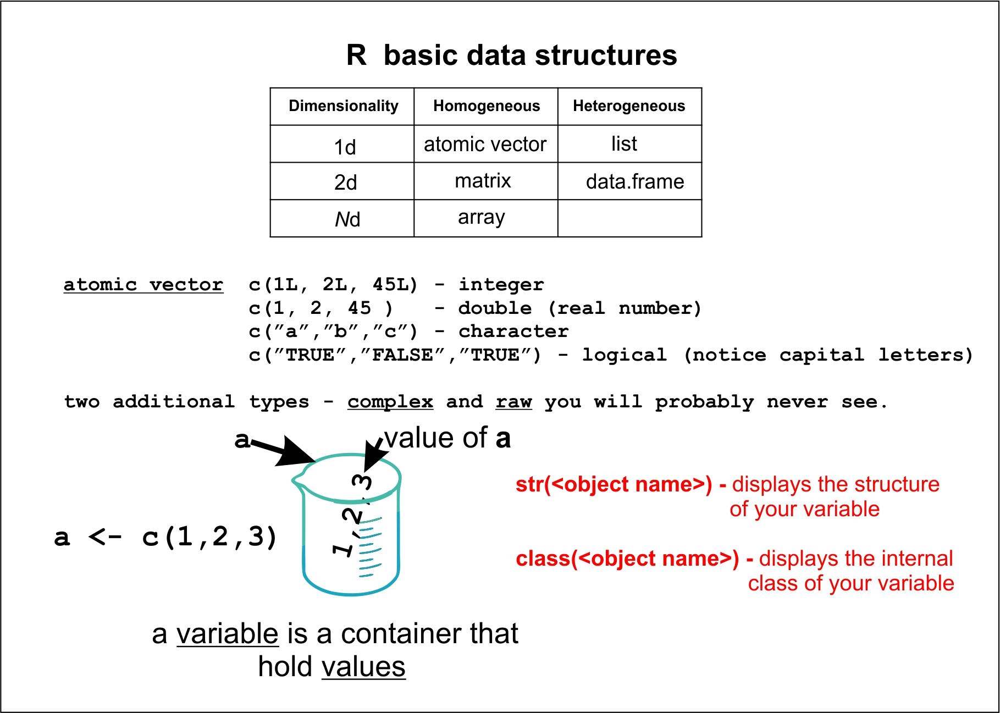

This is an R markdown file that contains code and output examples for the second class in our Introductory R workshop.
In this class we will focus on data frames and the exploratory data analysis and data visualization.

The first chunk of code checks you local R installation for required packages and installs them if they are not present.


```{r setup, include=FALSE}
knitr::opts_chunk$set(
	message = FALSE,
	warning = FALSE,
	include = FALSE
)
# Checking  for required packages and installing if not present

 if (!"tidyverse" %in% installed.packages()) {cat("Package 'tidyverse' is required but not available. Installing Tidyverse now.")
    install.packages("tidyverse", dep = TRUE)
    library("tidyverse")} else {require("tidyverse")}

if (!"reshape2" %in% installed.packages()) {cat("Package 'reshape2' is required but not available. Installing reshape2 now.")
    install.packages("reshape2", dep = TRUE)
    library("reshape2")} else {require("reshape2")}

if (!"naturalsort" %in% installed.packages()) {cat("Package 'naturalsort' is required but not available. Installing naturalsort now.")
    install.packages("naturalsort", dep = TRUE)
    library("naturalsort")} else {require("naturalsort")}


#library(tidyverse)
#library (reshape2)

```
A few conventions:

`my_function()` - this is a function with the name `my_function`

`my_function(`\<**`mandatory argument`**\>`)` - the mandatory argument(s) of `my_function` are in **bold**. Skipping mandatory arguments will result in error messages 

`my_function(`\<**`mandatory argument`**\>, \<`optional argument`\> `)` - optional arguments are in normal font. Skipping optional argument may result in unexpected behavior, but is rarely fatal 


I would like to start with a topic that we  briefly skimmed before: **How to get help?**

1) `help(`\<`function_hame`\>`)` for example `help(help)` will open up the help page for function `help()`
The shortcut for this is `?help`

2) `help.search(`**\`<search term`\>**`)` or `??`**\<`search term`>** will search all currently available help files for your **\<`search term`\>**

3) `example(`**\<`function_name`\>**`)` - will execute example codes that you can find at the end of help pages for most of R function.


Seek outside help. You are just starting  R, while countless people used the language and probably already faced your particular problem

5) R section of [Stack overflow](http://stackoverflow.com) general R questions

6) [Bioconductor support](https://support.bioconductor.org) - specific questions related to Bioconductor packages 

7) [Biostars](https://www.biostars.org) - general bioinformatics forum 

Books on R. There are too many to mention. Right now my two favorites are

[Garrett Grolemund, Hadley Wickham R for Data Science](http://r4ds.had.co.nz/index.html) - good for beginners, but somewhat opinionated


[Hadley Wickham Advanced R](http://adv-r.had.co.nz/) - after you are done with the first one.


Before we proceed,  I would like to briefly touch on two important topics - R organization and R data structures.

## **R Organization, Packages**

R is build around the concept of a *"package"* - a set of functions that perform related tasks. Such package could be binary or written in R.
[What R is writen in?](http://blog.revolutionanalytics.com/2011/08/what-language-is-r-written-in.html) - here you can find exact breakdown of how much R is written in R

*R distribution* you have downloaded last time contains 7 packages that cover the  majority of basic R functionality. In addition to that there are currently more than 10,000
additional packages that cover a variety of specific statistical methods. On the top of that there are 1296 packages of Bioconductor
To install a package we use `install.packages(`**"\<`package_name`\>"**`)` function.

Let's install package *`gplots`*, that among other things has a function for building heat-maps that we will use next time.

```{r, include=T, eval=F}
install.packages ("gplots")
```
R will automatically check for this packages in CRAN repository  and install it.Now, at this point  R downloaded and registered *`gplots`*, yet your current R session knows nothing about it.To attach a package to you current workspace you use `library(`**"\<`package_name`\>"**`)` function

```{r, include=T, eval=F}
library ("gplots")
```
Now, package *`gplots`* is attached to your current workspace and all functions inside of this package are available for you to use.

You can always look at the list of packages that are currently attached to your workspace by using **`SessionInfo()`** function. (for the sake of space saving I shortened actual output some
```{r,include=T}
sessionInfo()

```

## **Very brief introduction to R data structures**

Basic R data structures are classified by their **dimensionality** and **"homoginiety"** - homogeneous (same data type) or heterogeneous (different data types)


**Dimensionality** |   **Homogeneous**   |   **Heterogeneous**  
------------- | --------------------- | --------------------
    1d | Atomic vectors | List (vector of any vectors)
    2d | Matrix (vector with two dimensions)  | Data.frame (list of vectors with equal length) 
    *N*d | Array | 
[Hadley Wickham, Advanced R](http://adv-r.had.co.nz/Data-structures.html)

Unidimentional data structures, such as vectors, contain a sequence of values. There are 6 basic types of atomic vectors based on the type of values.

**`Atomic vectors`** 

`c(1L, 2L, 45L)` - integer (notice those L)

`c(1, 2, 45 )`   - double (real numbers)

`c(”a”,”b”,”c”)` - character

`c(”TRUE”,”FALSE”,”TRUE”)` - logical (notice capital letters)`

two additional types - complex and raw - you will probably never see.

To determine the nature of an R object you can use function **`str()`** or **`class()`** that we will try later 

 


## **Data frames in R base and Tydyverse**

R at the moment is undergoing a yet another conceptual expansion that aims at standardizing and simplifying manipulation of complex data structures, including *data frames*.
These efforts resulted in a creation of a family of packages under the umbrella name of *`Tidyverse`*.  I will mostly be focusing on R base but periodically I will show how things are in `Tidyverse`

The main focus of today's workshop is *data frames*. Internally, a data frame is a list of vectors of equal length with no type restriction. For a casual user a data frame looks  like a spreadsheet   

A `data frame` can be created from scratch using **`data.frame()`** function  

```{r, include=T}
# creating a dataframe from scratch
(df <- data.frame(first = c("a","b","c"), second =  c(1,2,3), third =   rnorm(3)))

```
The data frame  *`df`* has three columns, aptly named **first**, **second**, and **third**. Let's look at the structure of the `df` object using `str(`**\<`object name`\>**`)`

```{r, include=T}

str(df)

```
Notice, that by default  **data.frame()** function treats string as factors. To suppress this behavior you can set **`stringsAsFactors=F`** as in `df <- data.frame(first = c("a","b","c"), second =  c(1,2,3), third =   rnorm(3), stringsAsFactors=F)`               


Alternatively you can  create a data frame variable by loading a data set from a disk or the internet.R can handle all imaginable standard and proprietary data formats including Excel, STATA, SAS, SPSS and a variety of flat text formats such as  .csv - a comma-separated values or .tsv -  TAB separated values. Furthermore, many R import functions are flexible enough to be able to handle your data file  in a text format.  

Unless you tell R to do otherwise, R will always  attempt to open a file from your current working directory.

To determine what your current working directory is you can use **`getwd()`** function and to point to a new working directory you can use **`setwd()`** function. For example **`setwd("E:/David_CHIP")`** points to the directory David_CHIP on drive "E:".  The path on mac or Linux computers must conform to the  conventions of a respective operating systems: for example for a Mac - **`setwd("/Users/<your username>")`** would point to your default home director. Windows user, please notice that to ensure cross-platform compatibility R uses forward slash (**/**) for paths, not the backslash you are used to. 

For flat tables R uses **`read.`** and **`write.`** family of functions. The generic versions **`read.table()`** and **`write.tables()`** (see **`help(read.table)`** or **`help(write.table)`**)  take one mandatory argument - the name of your file, and a number of optional arguments to describe the structure of your table. Besides these generic functions there are several, so-called, wrapper functions that allow you to load/save specific types of tables without setting additional optional parameters.

**`read.csv()`** reads coma-separated files

**`read.delim()`** reads tab-separated files

Since our file is a coma-separated table, we will use **`read.csv()`** function.

all `read.` and `write.` function have one mandatory argument - a **file name**. If no path to this file is supplied the R will be looking for it in the current working directory. 


```{r, include=T}
sd <- read.csv("sample_data.csv")

```

Here, we created a new variable, **sd**, and "filled" this variable with a csv table from the disc. We allowed R to do what it chooses by default with this table.

Now let's explore our new table. 

1. The size or "dimensions" of a table could be called using **`dim()`** function 

```{r, include=T}
# dimensions of sd data frame
dim(sd)
```
The first number  here is the number of rows and the second is the number of columns.

**?** Look at `dim()` output. What type of data structure is this?

2. The number of columns or rows in a data frame can be also determined using **ncol()** and **nrow()** functions
```{r, include=T}
ncol(sd)# columns

nrow(sd)#rows
```

3. To look at the beginning of any data structure in R, including data frames, use `head(`\<**`name_of_variable`**\>, \<`number_of_lines`\> `) function
```{r, include=T}
head(sd,3)

```

**?** What do you think **`tail()`** function do?

4. You can look at the names of all columns in the data frame by calling function **`names()`**. This is a generic function that will work any R structure. Alternatively, you can use a data frame-specific function **`colnames()`** - the output will look the same.

```{r, include=T}

names(sd)


colnames(sd)

```
**?** What do you think **`rownames()`** function do?

You can also use `colnames()` and `rownames()` to assign column and row names. 

5. Finally you can open an entire data frame in RStudio viewer using **`View()`** function  of by single-clicking at your data frame name in a **Global Environment** panel at the upper right corner.

```{r, include=T, eval=F}

View(sd)

```
**sd** is a table that contains an entire RNA Seq experiment. In this experiment we compared gene expression in animals with three distinct genotypes - WT, KO and DKO. There are 4 biological replicates for the WT animals, 4 for the KO and 3 for DKO. The first group of columns contain gene names, exon names, chromosome number where the gene is located at and the beginning and end position for this gene on  a chromosome. The second group of columns contains the number of reads that mapped to each of the genes. This table has been prefiltered to remove all genes that had zero reads mapped at all conditions.

## Importing tables the Tydiverse way

The Tydiverse function that loads CSV files is called `read_csv()`.If you use R studio **Import Dataset** in the  Environment panel this function will be used by default.  Lets see how it works. I will create a new variable called **sd1** and import the same data set as before.

```{r, include=T}

sd1 <- read_csv("sample_data.csv")

```
 If you use **`View()`** you will not notice any difference between **sd** and **sd1**. From a user's perspective, these data frames are identical. Instead, let's instead type `sd1` on your console and compare it to `head(sd)` 

```{r, include=T}
#this is classic dataframe view. Please, always use head() - or you will flood your console with output
head(sd,3)

#this is a Tidyverse output

sd1 

```
Several thing to notice: 
1) The output is more informative: you can see the **dimensions** of you table - no need to use **`dim()`** and you can see *types* of individual columns- no need to use **`str()`** 
                                                            
2) The console output in tidyverse is always limited by the first 10 rows - no console flooding anymore and no need to use **`head()`** (you can use `head()` if you want a shorter output)

3) The funny name of the data type: Tibble instead of data.frame

4) Some other differences that we might touch upon later

## Subsetting.

Perhaps one of the most common tasks that you would have to perform in R is data rearranging, sub-setting, and "tiding up". Often you spend about 80% of your time on that and only 20% on actual analysis. To emphasize it even more -- poorly arranged data are often rather unapproachable and simple data rearrangement sometimes is sufficient to give you a hint on how to analyze your data. Therefore, R provides multiple tools and datatypes that facilitate data access, filtering, and sub-setting. You have seen some of these methods in the tutorial last time

to quickly recap it.
```{r, include=T}
# a a vector of characters

a <- c("a","b","c","d","e")

a

a[3]

a[1:3]

a[c(1,4,5)]

a[c(5,4,1)]

```

This is how  vector sub-setting operations translate to data frames.

```{r, include=T}

# Accsessing a column by name:  Output - a vector (of factors)
head(sd$genes,3)

#Accessing a column by index with single brackets: Output - a single-column dataframe
head(sd[1],3)

#accessing a column by index with double brackets: Output - a vector (of factors)
head(sd[[1]],3)

# same for a tibble
# Accsessing a column by name:  Output - a vector (of characters)
head(sd1$genes,3)

#Accessing a column by index with single brackets: Output - a tibble - a single-column dataframe
sd1[1]

#accessing a column by index with double brackets: Output - a vector (of characters)
head(sd1[[1]],3)

```
Here we see another important distinction between data frames and tibbles: by default data frame treats strings as **factors**, whereas tibble treats strings as **characters**

To change data types from one to another use **`as. `** family of functions. For example, let's change the type of **`sd1$chr'** that contains chromosome locations for each gene. I want them to become **factors**. Remember, **factors** is a type of data that describes categories for categorical variables. In our case, the categorical variable is chromosome ("chr"). Mice have 19 autosomes and X and Y - 21 chromosomes in total. In our case, we say that **chr** is a **factor** with 21 **levels**.


```{r, include=T}
sd1$chr <- as.factor(sd1$chr)

#now lets look at sd1 again
head(sd1,3)
```
now the sd1$chr contains factors. Lets check how many levels are there.- Use `nlevels(`\<**`name_of_variable`**\>`)
```{r, include=T}
nlevels(sd1$chr)
```
22!!!! Something is not right here. Let's look at actual levels of sd1$chr. Use `levels(`\<**`name_of_variable`**\>`)
```{r, include=T}
levels(sd1$chr)
```
MT???!!! what's that? Can we get rid of MT? (Yes, we can but first let's  select all rows where **chr** IS **MT**
```{r, include=T}
# Can we select rows where chr IS "MT"?
sd1[sd1$chr == "MT",]
```
This is not what we want, though. We want rows that DO NOT have **MT** in **chr** column. 
To achieve that we could use and additional logical operators, for example: 

**|** - or

**&** - and

**!** - not

now, it you put a ! (not) in front of an expression, you will select all elements that do NOT evaluate to `TRUE`
```{r, include=T}
sd1 <- sd1[!(sd1$chr == "MT"),]
```
At, this point **sd1** contains all genes that are NOT not on MT chromosome (all genes for which **chr** column is not equal to "MT"), but it still contain factor levels for MT. You can verify it by tuning **`levels(sd1$chr)`**. It is annoying because this empty category will be showing in any later analysis as empty. To get rid of unused factor levels,  use **`droplevels()`** function.

```{r, include=T}
# look at levels. "MT" still persists, although it has no values associated with it
levels(sd1$chr)

#droplevel() removes all unused factors
sd1$chr <- droplevels(sd1$chr)

levels(sd1$chr) # and now "MT" is gone
```

Something more complicated: Find all genes in the first chromosome with gene length  larger than 10 000. 
Let's create a variable **long.genes** for this.

```{r, include=T}
#subsetting based on two conditions
(long.genes <- sd1[(sd1$chr=="1" & sd1$ExonLength>10000),])
```
**?** now, this is too much. I just want **gene names** for all genes on the first chromosome with gene length >10000. Can we do that?

Finally, I would like to know **how many**  of the genes on the first chromosome are longer then 10000. For this, you can use either **`dim()`** or **`length()`** function with an appropriate argument.
```{r, include=T}
# using dim()
dim(long.genes)[1]

#using length()
length(long.genes[[1]])
```
### Extracting a set of columns

We would like to copy our  gene annotation (first five columns) into a separate table that we assign to **an.table** variable.

```{r, include=T}
an.table <- sd1[,(1:5)]

#or

an.table <-  sd1[,c(1:5)]

```
**?** What is the potential advantage of the second notation?

### Deleting column (I am using **an.table** to demonstrated this). **Beware! This is permanent!**
```{r, include=T}
# by name
an.table$ExonLength <- NULL

#by index
an.table[2] <- NULL

#several columns at the same time
an.table[2:3] <- NULL

#let's restore an.table to its former glory
an.table <- an.table <- sd1[,(1:5)]
```
### Deleting Rows
```{r, include=T}
# by index
an.table <- an.table[-(1:1000),]

# by a pattern. I would like to delete all genes that start with "A"
an.table <- an.table[-(grep("^A",an.table$genes)),]


#lets restore an.table to its original state
an.table <- an.table <- sd1[,(1:5)]
```


## Selecting rows based on a pattern

I would like to see the expression of all members of "Ccl" family of cytokines. Let's collect them in  a new variable   designated  *ccl*

```{r, include=T}
#selecting rows based on a pattern
(ccl <- sd1[(grep("^Ccl",sd1$genes)),])
```
here we use **`grep()`** function  that searches for patterns in elements of a character vector. `grep()` takes two mandatory arguments - the first is the pattern and the second is the vector, whose elements we search for this patter. As we are looking for  specific genes the place to search for is the first **sd1$genes** column. The pattern in this case is "^Ccl"; the "hat" in the beginning indicates that we are looking at strings that **beggin** with "Ccl". Pattern written like this are called "regular expressions".  We can literally spend couple of weeks talking just about them. For a relatively gentle introduction see [Regexone tutorial](https://regexone.com/lesson/introduction_abcs).  

As called without any additional parameters **`grep()`** returns position (indices) of matching elements in a vector. `grep()` with `values = T` option returns actual matching elements  and `grep()` with `invert=T` option returns all elements that  **do not** match the pattern (inverted selection)  

### Selecting columns based on a pattern

Column names could be accessed using `colnames()` function. Now, I would like to collect all *DKO* experiments to a new table that also contain gene names
```{r, include=T}
colnames(sd1) # returns a vector with all column names

dko <-  sd1[, c("genes", grep("^DKO", colnames(sd1), value = T))]
```
Let's untangle this expression. First, look at the rightmost part of the expression - **`grep("^DKO",colnames(sd1),value=T)`**. 
This is the same `grep()` function we saw before. However, in this case, we are looking for strings that start with *DKO*. These strings are taken from the name of columns in *sd1* as supplied to us by `colnames(sd1)`. However, instead of indices of matching pattern  I requested actual values that contained that pattern by using **value=T** parameter in `grep()` - see what happens if you just run `grep("^DKO",colnames(sd1),value=T)`
```{r, include=T}
grep("^DKO",colnames(sd1),value=T)
```
the output of grep() function above is a vector of column names that we combine with "genes" - name of the first column that we also want, and use this combined vector of names to extract corresponding columns from **sd1**. 

### Adding rows and columns

```{r, include=T}

# adding empty column 
an.table[,"new_column"] <- NA

#or

an.table$new_column1 <- NA

# adding new column by modifying an existing column
an.table$new_column2 <-  log2(an.table$ExonLength)
```
If you need to add multiple columns you can use  **`cbind()`** function. **`cbind()`** for columns, and its companion, **`rbind()`**,  combines vectors by columns or rows respectively. When given two data frames cbind will join them side by side provided that the number of rows (for **`cbind`**) or columns (for **`rbind`**) are the the same in both  data frames.
**`cbind`** is convenient when you need to add multiple columns at the same time. For example, let's log-transform read counts in all experimental columns in **sd1** and add log-transformed values back **sd1**  as additional columns

```{r, include=T}
# adding multiple colums at once use cbind()
sd1 <- cbind(sd1, log2(sd1[,(6:16)]+1)) 
```
Here as a first argument we use *sd1* data frame. As a second argument we take all rows for sd1 columns from 6 to 16  - **sd1[,(6:16)]** and add **1** to each value stored in these columns. This, produces a data frame  that gets log-transformed and used as a second argument for `cbind`. There is, however a small problem - if look at  column names you will notice that we now have a set of duplicated names which is generally a bad idea. we can fix that by using functions **`colnames()`** and **`paste0()`**.

`paste0()` is a function that concatenate strings,

```{r, include=T}
# changing names on new columns by adding "log_" 

colnames(sd1)[17:27] <- paste0("log_",colnames(sd1)[17:27])
```
An alternative way to do this is to use 'bind_cols()' function from `tidyverse`, followed by changing column names as above

```{r, include=T}
sd2 <- bind_cols(sd1, log2(sd1[,(6:16)]+1))

colnames(sd2)[17:27] <- paste0("log_",colnames(sd2)[17:27])
```
The advantage of using `bind_cols()` as opposed to `cbind()` is that `bind_cols()`, being a `tidyverse` function, preserves tibbles

### Sorting 

There are several ways of sorting things in R out of which I suggest to use R base function **`order()`**, `tidyverse` function **`arrange()`** or **`naturalorder()`** from package **naturalorder**.
**sd1** is sorted by gene name. Let's re-sort **sd1** by  chromosome numbers.

```{r, include=T}
#Rbase
sd1 <- sd1[order(sd1$chr),] 

#tidyverse
sd1 <- arrange(sd1, chr)
```
Both of these methods have a minor problem - they sort things alphanumerically. So if we look at sorted chromosome numbers in **sd1** they will be ordered as 1,10,11,12,13,14,15,16,17,18,19,2.... instead of
1,2,3,4.... as we would like. There there are several non-intuitive ways of changing this but instead i recommend using **naturalorder()** function from **naturalorder** package instead of regular **order()**

```{r, include=T}
#Rbase + naturalorder package
sd1 <- sd1[naturalorder(sd1$chr),] 

```
Now if you look at **levels** of the factors in `sd1$chr` (`levels(sd1$chr)`) you will notice that they are still sorted alphanumerically.In order to enforce order of levels
we will have to explicitly set the order of factor levels. We will do this using **`factor()`** function with **`levels=`** argument. `factor()` function take a vector and convert it to factors. We will apply this function to sd1$chr column. Since this column already contains factors,  we only use it to change the order of levels 

```{r, include=T}
#lets set levels of factor sd1$chr in a correct order
sd1$chr <- factor(sd1$chr, levels=c((1:19),"X","Y"))

#lets look at the value of levels here. what does this construct create?
#finally you can see that the levels in a correct order
levels(sd1$chr)

```

### Statistics on columns and rows

You can get a summary of many column based statistics using function **`summary()`** with your data frame as an argument

```{r, include=T}
summary(sd1)
```
or you can do it for a single column. For example `summary(sd1$chr)` shows you the number of gene for each chromosome in your data set.
```{r, include=T}
# or you can get a summary for a single column
summary(sd1$chr)
```
if you want to calculate some statistics for a single column you can use a wide variety of R statistical functions. Using **`sd1$ExonLength`** as an example
```{r, include=T}
#mean
mean(sd1$ExonLength)

#standard deviation
sd(sd1$ExonLength)

#median
median(sd1$ExonLength)

#median absolute deviation
mad(sd1$ExonLength)

#quantiles
quantile(sd1$ExonLength, probs = seq(0, 1, 0.25), na.rm = FALSE, names = TRUE, type = 8)

```
Statistics on a group of columns or group of rows is a bit trickier and require the use of functions from the **`apply()`** family. The main purpose of these functions is to perform repetitive actions on structured data such as list, matrices, data frames and arrays. At the first approximation they are similar to  various loop control structures, in reality they are much more than this. Today we will use the most generic form of `apply` functions.

General format for `apply` is `apply(`\<**`array or matrix`**\>, \<**`applying direction`**\>,\<**`function to be applied`**\> `)`
applying direction: 1- rows, 2-columns, c(1,2) both row and columns

Now let's calculate the mean log count for each gene per experimental group (WT, KO, DKO). If you look at **`sd1`** data frame WT is located at 17:20, KO at 21:24 and DKO at 25:27 columns
now let's construct our apply function
```{r, include=T}
#calculating the meanvalue of a group of columns
sd1$wt_mean <- apply(sd1[,17:20],1,mean)
#st.dev for the same
sd1$wt_stdev <- apply(sd1[,17:20],1,sd)

#same as above but without refering to specific column locations
sd1$ko_mean <- apply(sd1[,grep("^log_KO",colnames(sd1))],1,mean)

#same as above for standard deviation
sd1$ko_sd <- apply(sd1[,grep("^log_KO",colnames(sd1))],1,sd)

```

## Exploratory Data Analysis

### Plotting histogram

```{r, include=T}
# Histogram plot with the default parameters
hist(sd1$ExonLength)

# add some bins
hist (sd1$ExonLength,
      breaks = 100)

# set a limit to X axis (xlim()) and add main title (main=)
hist (sd1$ExonLength,
      breaks = 100,
      xlim=c(0,40000),
      main= "Gene lenght distribution in expressed mouse genes")
#change add red fill
hist (sd1$ExonLength,
      breaks = 100,
      xlim=c(0,40000),
      main= "Gene lenght distribution in expressed mouse genes",
      col= "red")
# change the legend of the X-axis
hist (sd1$ExonLength,
      breaks = 100,
      xlim=c(0,40000),
      main= "Exon lenght distribution in expressed mouse genes",
      col= "red",
      xlab=c("Gene Length(bp)"),
      las=1)
# and turn Y axis labels horisontally (las), increasing axis numbers by 20% relative to the default (cex.axis), and increase axis legendsby 20% (cex.lab)
hist (sd1$ExonLength,
      breaks = 100,
      xlim=c(0,40000),
      main= "Gene lenght distribution in expressed mouse genes",
      col= "red",
      xlab=c("Exon Length(bp)"),
      las=1,
      cex.axis=1.2,
      cex.lab = 1.2
      )

#and finally, change the size of plot margins with par
par(mar=c(5,6,4,2)+0.1) #see help(par) for many more posibilities

hist (sd1$ExonLength,
      breaks = 100,
      xlim=c(0,40000),
      main= "Gene lenght distribution in expressed mouse genes",
      col= "red",
      xlab=c("Gene Length(bp)"),
      ylab="", #removes Y-label
      las=1, #turns Y axis numbers by 90 degrees
      cex.axis=1.2, #font size of the axes number is increased by 20% relative to default
      cex.lab = 1.2) #font size of axex labels is increased by 20% relative to default.
      

mtext("Frequency",side=2,line=4,cex=1.2) #adds new y label a bit further from the axis

#and finally add legend at position 20000,2800, that shows a square (pch=15) of red color 
legend(17000, 2800, legend=c("Gene frequencies"),
       col=c("red"), pch=15, cex=1.2)
```

### Density plots

```{r, include=T }
plot(density(sd1$ExonLength), xlim=c(0,20000), col="blue", lwd=2)
```

### scatterplots

The easiest way to create a scatter plot is to use **`plot()`** function. This is a generic function that can either plot an R object or two numerical vectors against each other

```{r, include=T }
# Ploting one log-transformed column versus the other

plot(sd1$log_WT_rep_1, sd1$log_WT_rep_3,
    pch=19,
    col="steelblue")

abline(lm(sd1$log_WT_rep_1~sd1$log_WT_rep_3), col="red",lwd=2)
```


what is we want to see correlations between all 4 WT replicates
```{r, include=T }

# Corelation plot for all WT replicas that shows pairwise correlations in the upper half
# panel.cor() function is stolen from manual page for pairs()

panel.cor <- function(x, y, digits = 2, prefix = "", cex.cor, ...)
{
    usr <- par("usr"); on.exit(par(usr))
    par(usr = c(0, 1, 0, 1))
    r <- abs(cor(x, y))
    txt <- format(c(r, 0.123456789), digits = digits)[1]
    txt <- paste0(prefix, txt)
    if(missing(cex.cor)) cex.cor <- 0.8/strwidth(txt)
    text(0.5, 0.5, txt, cex = cex.cor * r)
}

pairs(~ sd1$log_WT_rep_1 + sd1$log_WT_rep_2 + sd1$log_WT_rep_3 + sd1$log_WT_rep_4, 
      data=sd1,
      col="steelblue",
      upper.panel = panel.cor,
      lower.panel= panel.smooth) #for symmetric matrixes ommits the upper half

```

### Boxplots

Generic function **`boxplot()`** can a box-and-whiskers plot of a single or multiple variables. **`boxplot()** function ha a number of customizing options that you can find and the manual page. 
```{r, include=T }
#simple box plot of a single column
boxplot(sd1$log_WT_rep_1,
        col="pink")
#now we can actually add datapoints to this using stripchart()

stripchart(sample(sd1$log_WT_rep_1,1000), #uses the same column as boxplot, but takes random 1000 points - to avoid showing 15000 datapoints
          vertical=T,
          method = "jitter", #spread around overlapping values
          add = TRUE, #adds to the previous plot
          pch = 19, #large circle 
          col = 'steelblue')


#This is how you can add text to a plot
text(1.2,9.5,"Median",cex=1)
text(1.2,6.6,"First Quartile",cex=1)
text(1.2,11.2, "Third Quartile", cex=1)
text(1.2,17.8,"+1.5*(Interquartile range)",cex=1)
text(1.2,0.3,"-1.5*(Interquartile range)",cex=1)
text(1.2,19, " Likely outliers", cex=1)

# a boxplot of a continous variable based on a categoriacal variable - plot gene lenght distribution per chromosome
boxplot(sd1$ExonLength ~ sd1$chr)

# we can log transform gene length
boxplot(log2(sd1$ExonLength) ~ sd1$chr)


#a boxplot of multiple columns
par(mar=c(5,8,4,2)+0.1) # margins on the  left side (8) were increased to accomodate long labels 
boxplot(sd1[,(17:27)],horizontal = T,#boxplot was turned 90 degrees (horizontal=T)
        las=1, #labeles were rotated 90 degrees
        col=c(rep("pink",4),rep("steelblue",4),rep("darkgreen",3)) #and colored by experimental groups
        ) 
```

### Barplot

**`barplot()`** creates bar-plots. It takes a single mandatory argument - a vector or matrix of values that describes the height of the bars. In addition it takes a large number of optional argument to customize the output. Lets plot the distribution of genes among chromosomes in our data-set. I will use the **`summary()`** function to get my gene counts.  

```{r,include=T } 
summary(sd1$chr)

# you can either asign the out put of summary() above to a variable or you can simply use it as a argument of barplot()
barplot (summary(sd1$chr))

```
I will let you use the manual page (help(bar-plot)) to prettify the output of this function

### Pie-charts

Please, do not use them if you have more than 2 categories, but if you have to there is a function **`pie()`**. Again, using example above,
```{r,include=T } 
pie(summary(sd1$chr),
    col=rainbow(nlevels(sd1$chr)),
    main="rainbow()")


par(mfrow=c(3,2))
par(mar=c(0.5,0.5,0.5,0.5)+0.1)

pie(summary(sd1$chr),
    col=rainbow(nlevels(sd1$chr)),
    main="rainbow()")
pie(summary(sd1$chr),
    col=heat.colors(nlevels(sd1$chr)),
    main="heat.colors()")
pie(summary(sd1$chr),
    col=terrain.colors(nlevels(sd1$chr)),
    main="terrain.colors()")
pie(summary(sd1$chr),
    col=topo.colors(nlevels(sd1$chr)),
    main="topo.colors()")
pie(summary(sd1$chr),
    col=cm.colors(nlevels(sd1$chr)),
    main="cm.colors()")

```
